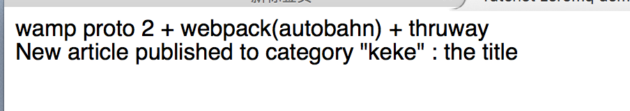

Ratchet zeromq demo
-----
####Environment####
+ `brew install zeromq`
+ `pecl install channel://pecl.php.net/zmq-1.1.3`
+ `composer update`
+ `npm run build`

####Run####
for wamp 1 + ratchnet

+ `php ratchet_server.php`
+ open `ratchet_index.html` in browser
+ `php index.php`

for wamp2 + thruway

+ `php thruway_server.php`
+ open `thruway_index.html` or `thruway_minified.html` in browser
+ `php index.php`

####Wamp version####
ratchet does not support wamp proto v2, the npm package of autobahn use wamp proto v2. So webpack version for ratchet would not work, you'd need to use thruway.

####Result####

####References####
+ [convert from ratchnet to thruway](https://github.com/voryx/Thruway/issues/96)
+ [ratchnet push example](http://socketo.me/docs/push)

